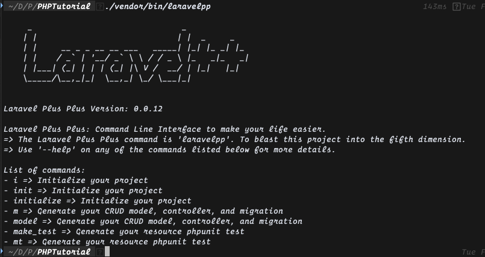

# Laravel++

Autogenerate your CRUD operations with Swagger like API documentation

## Requirements

Laravel version >= 5.7

## Installation

`composer require laravelpp/laravelpp`

## CLI Commands

Your command CLI command bin path is `./vendor/bin/laravelpp`

## Getting Started

Run the initialize command to get started:

`./vendor/bin/laravelpp init`

Run the model command to generate a migration, model, and completed controller:

This controller is overwritable when you declare the same method name in it's controller class.

`./vendor/bin/laravelpp model (model-name)`

Update your migration and model file. Then declare your routes with `Route::apiResource`.
The controller has all api resources completed by default. These will fail if your migration and
model are not completed. And your routes are not defined.

Steps to do after:

- Update model file
- Update migration file
- Define your routes with Route::apiResource

Run the make_test command to make phpunit tests:

`./vendor/bin/laravelpp make_test (resource-route-name)`

After your tests are completed. Update your testStore and testUpdate methods.
Add the keys available to your request body. If you have special headers like
"Authorization" add those to the public variable $headers in that file.

Steps to do after:

- Update request body based on the controller model's $fillable keys
- Update your headers for all the requests

`phpunit`

## API Documentation

There are Swagger-like API Documentation that requires no configuration.
This was created on your initialize command. This docs with regenerate the javascript
on API route changes.

The API documentation lives on your web route '/docs'
Run the server and listen to url:

`http://localhost:8000/docs`

For more information on the API docs check out the details here: [Autogenerated API Documentation Docs](./docs/API_DOCUMENTATION.md)

## Gloabl Controller

All of your CRUD operations were created in the GlobalController.
The GlobalController gets your model based on the class name of the controller.
Do not change the class name of the generated controller.

All methods are overwritable but have the functionality complete by default.
Restrict the routes you want accessible through the apiResource declaration.
Update the tests for ignoring the routes that do not exist.

By Default these methods are created:

- index
- show
- store
- update
- destroy

There are many querystrings available in the index method.
These contain options like:

- include=(associated model names comma separated)
- where=(key:value rows comma separated and key value pairs are semi-colon separated)
- order=(key DESC/ASC rows comma separated and key DESC/ASC pairs are one single space separated)
- limit=(amount returned the default is 25 plus count)
- offset=(number_to_skip * limit option the default is 0)

For more information about the Global Controller check out the details here: [Global Controller Docs](./docs/GLOBAL_CONTROLLER.md)

## Php Unit tests

By default the tests check the format of the response and the status code.
There are tests for the querystrings. That you can update. The include
querystring test must be updated based on your schema. Replace `$include_options = false;`
With `$include_options = '(string of associated model names comma separated)'`;

The tests cover all querystrings with the same successful data format as default index currently.

Test cover:

Index:

- status_code = 200
- json_format = { data: (array), count: (number) }

Show:

- status_code = 200
- json_format = { id: (integer) }

Create:

- status_code = 201
- json_format = { id: (integer) }

Update:

- status_code = 200
- json_format = { id: (integer) }

Destroy:

- status_code = 204

For more information about the PHP Unit Tests check out the details here: [Generated PHP Unit Test Docs](./docs/PHPUNIT.md)
